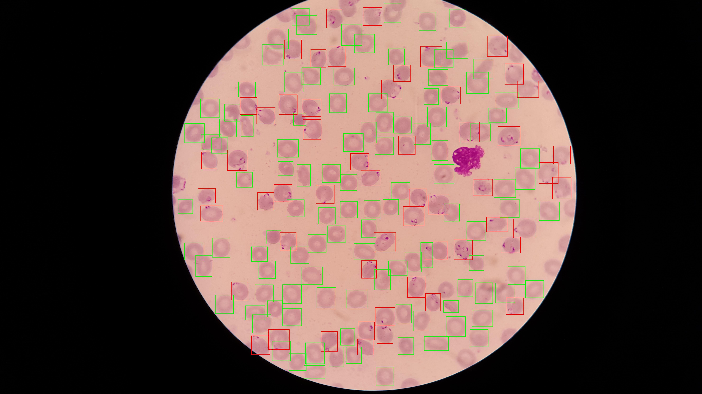
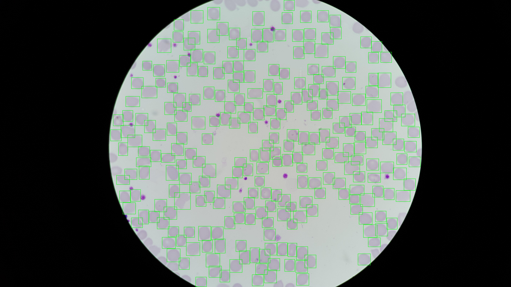

# Class Imbalance Scripts

This folder contains the scripts used to prepare the data, train YOLO models, and compare results for the malaria detection project.

The explanations below use simple language so the pipeline is easy to understand.

---

## What is class imbalance?

In our dataset there are two classes:

- **Parasitized** — infected red blood cells
- **Uninfected** — healthy red blood cells

Usually there are more **uninfected cells** than **parasitized cells**. 
This situation is called **class imbalance**.

If we train the model on this data without any fix, it may learn to say “uninfected” most of the time, because that is the majority class. We want the model to learn both classes well. So we use two kinds of fixes:

1. **Class weights** — We give more importance to parasitized cells during training so the model pays more attention to them.
2. **Oversampling** — We repeat images that contain parasitized cells in the training data so the model sees them more often.

---

## The four training conditions (A, B, C, D)

We train the same YOLO model four different ways to see which method works best

| Condition | What we do | Purpose |
|-----------|------------|-----|
| **A** | Train as usual (no weights, no oversampling) | Baseline: see how the model does without any fix. |
| **B** | Use **class weights** in the loss (parasitized gets higher weight) | So the model cares more about getting parasitized cells right. |
| **C** | Use **oversampling**: images with parasitized cells appear 3× in the training list | So the model sees parasitized examples more often. |
| **D** | Use **both** oversampling and class weights | Combine both fixes. |

After training, we evaluate all four models on the same validation and test sets.
This allows a fair comparison of which imbalance method works best.

---

## What happens when the pipeline runs

The pipeline follows these steps:

**1. Split the dataset**

Patients are divided into:

- train
- validation
- test

Each patient appears in **only one split** to avoid data leakage.

---

**2. Convert annotations to YOLO format**

The original NIH annotations use **polygons**. We convert them into:

- bounding boxes
- YOLO label files

The processed data is saved in:

- `data/processed/`

---

**3. (Optional) Verify annotations**

We draw bounding boxes on some images to check that the conversion was correct. The images below are **examples we used to make sure the conversion is correct** (red = parasitized, green = uninfected).




---

**4. Handle class imbalance**

We prepare two things:

- class weights calculated from the training labels
- an oversampled training list

These are used during training when running the model.

---

**5. Train the models**

We train the YOLO model four times, once for each condition:

- A
- B
- C
- D

Each training run saves its results in a folder inside:

- `runs/detect/`

Example:

- `runs/detect/malaria`
- `runs/detect/malaria_weighted`
- `runs/detect/malaria_oversampled`
- `runs/detect/malaria_oversampled_weighted`

---

**6. Evaluate the models**

Finally we evaluate the best model from each condition on the validation and test sets.

The script `evaluate_conditions.py`:

- Compares all four models
- Prints the results
- Saves the results to CSV files

Example output files:

- `condition_comparison_val.csv`
- `condition_comparison_test.csv`

**Final result**

At the end we have four trained models and a direct comparison of their performance on the same dataset. This allows us to see which method handles class imbalance best.

---

## Data Splitting Strategy

To ensure fair evaluation, we split the dataset **by patient**, not by individual images.

The dataset is divided approximately as:

- 70% Training set
- 15% Validation set
- 15% Test set

Each patient appears in only one split.

**Why split by patient?**

If images were split randomly, images from the **same patient** could appear in both training and testing. This would allow the model to indirectly see test data during training, which is known as **data leakage**.

Splitting by patient prevents this and ensures the evaluation reflects **true generalisation to unseen patients**.

**Dataset roles**

| Dataset | Purpose |
|---------|---------|
| Training set (70%) | Used to train the model and update its parameters |
| Validation set (15%) | Used during development to compare models and tune experiments |
| Test set (15%) | Used only for the final evaluation of the chosen model |

## Evaluation Metrics

To evaluate detection performance, we report the following metrics.

### Basic counts

| Metric | Meaning |
|--------|---------|
| **TP (True Positive)** | Correct detection (predicted label matches ground truth) |
| **FP (False Positive)** | Incorrect detection (model predicted infected but it was healthy) |
| **FN (False Negative)** | Missed detection (infected cell not detected) |

### Recall

Recall measures **how many real infected cells were detected**.

```
Recall = TP / (TP + FN)
```

Example: `Recall = 0.86` means the model detected 86% of infected cells.

In medical applications, **high recall is important**, because missing infected cells can be critical.

### Precision

Precision measures how many predicted infected cells are actually infected.

```
Precision = TP / (TP + FP)
```

High precision means fewer false alarms.

### F1 Score

The F1 score balances precision and recall.

```
F1 = 2 × (Precision × Recall) / (Precision + Recall)
```

This metric is useful when both false positives and false negatives matter.

### Intersection over Union (IoU)

IoU measures how well the predicted bounding box overlaps the true box.

```
IoU = overlap area / union area
```

**Typical interpretation:**

| IoU | Meaning |
|-----|---------|
| 1.0 | Perfect overlap |
| ≥ 0.5 | Usually considered a correct detection |
| ≥ 0.9 | Very precise localisation |

### mAP Metrics

**mAP50**

Mean Average Precision when a detection is considered correct if:

```
IoU ≥ 0.50
```

- detection ability
- approximate box placement

**mAP50-95**

A stricter metric that averages performance over multiple IoU thresholds (0.50–0.95). This metric rewards precise localisation of cells.

---

### Results

Metrics for these experiments were extracted from:

- `runs/detect/condition_comparison_val.csv`
- `runs/detect/condition_comparison_test.csv`

Values are rounded to two decimal places.

**Validation set Results**

| Condition | Parasitized R | Parasitized P | Parasitized F1 | Uninfected R | Uninfected P | Uninfected F1 | mAP50 | mAP50-95 |
|-----------|---------------|---------------|----------------|--------------|--------------|---------------|-------|----------|
| A (baseline) | 0.00 | 1.00 | 0.00 | 0.97 | 0.97 | 0.97 | 0.50 | 0.44 |
| B (weighted) | 0.84 | 0.80 | 0.82 | 0.98 | 0.93 | 0.95 | 0.92 | 0.76 |
| C (oversampled) | 0.70 | 0.72 | 0.71 | 0.98 | 0.97 | 0.98 | 0.85 | 0.71 |
| D (oversampled + weighted) | 0.86 | 0.83 | 0.84 | 0.97 | 0.95 | 0.96 | 0.94 | 0.77 |

**Test set Results**

| Condition | Parasitized R | Parasitized P | Parasitized F1 | Uninfected R | Uninfected P | Uninfected F1 | mAP50 | mAP50-95 |
|-----------|---------------|---------------|----------------|--------------|--------------|---------------|-------|----------|
| A (baseline) | 0.36 | 0.19 | 0.25 | 0.99 | 0.75 | 0.85 | 0.58 | 0.48 |
| B (weighted) | 0.85 | 0.89 | 0.87 | 0.96 | 0.91 | 0.93 | 0.96 | 0.78 |
| C (oversampled) | 0.81 | 0.71 | 0.76 | 0.95 | 0.98 | 0.96 | 0.90 | 0.77 |
| D (oversampled + weighted) | 0.87 | 0.91 | 0.89 | 0.98 | 0.90 | 0.94 | 0.96 | 0.79 |

**Key Finding**

Condition D (oversampling + class weights) achieved the best overall performance.

It produced:

- the highest parasitized F1 score
- the best mAP50
- the best mAP50–95

Therefore, Condition D is selected as the main YOLO model for comparison with the two-stage pipeline.

---

## What each script does

| Script | What it does |
|--------|--------------|
| **create_splits.py** | Splits the dataset by **patient** into train / val / test (e.g. 70% / 15% / 15%). So the same patient never appears in more than one set. |
| **convert_to_yolo.py** | Converts the NIH polygon annotations into YOLO format (one `.txt` file per image with class and box coordinates). Writes images and labels into `data/processed/`. |
| **verify_conversion.py** | Optional. Draws boxes on a few images so you can check that the conversion looks correct. |
| **compute_class_weights.py** | Reads the training labels, counts how many parasitized vs uninfected cells there are, and computes **class weights**. You can add these to `config/default.yaml` for Conditions B and D. |
| **build_oversampled_train_list.py** | Builds a special training list where images that contain at least one parasitized cell appear **3 times**. Used for Conditions C and D. |
| **train.py** | Trains the YOLO model. You run it once per condition (A, B, C, D) with the right config or flags (e.g. `--oversample` for C, `--oversample --weighted` for D). |
| **evaluate_conditions.py** | Runs the trained models on val and/or test and writes a comparison table (Precision, Recall, mAP, etc.) to CSV. |
| **run_publication_predictions.py** | Optional. Runs the model to save prediction figures (e.g. for the dissertation). |

---

## How to Run the Class Imbalance Experiment

Run the following commands from the project root (`malaria-yolov11/`). If your system uses `python` for Python 3, you can replace `python3` with `python`.

### 1. Prepare the Data (run once)

Split the dataset and convert annotations to YOLO format.

```bash
python3 scripts/class_imbalance/create_splits.py
python3 scripts/class_imbalance/convert_to_yolo.py
```

(Optional) Check that bounding boxes look correct:

```bash
python3 scripts/class_imbalance/verify_conversion.py
```

### 2. Handle Class Imbalance

Compute class weights and create the oversampled training list.

```bash
python3 scripts/class_imbalance/compute_class_weights.py
python3 scripts/class_imbalance/build_oversampled_train_list.py
```

These steps prepare the settings needed for Conditions B, C, and D.

### 3. Train the Models

We train the YOLO model under four conditions.

**Condition A – Baseline**

Standard training (no weighting, no oversampling).

```bash
python3 scripts/class_imbalance/train.py
```

**Condition B – Class Weights**

```bash
python3 scripts/class_imbalance/train.py --weighted
```

**Condition C – Oversampling**

```bash
python3 scripts/class_imbalance/train.py --oversample
```

**Condition D – Oversampling + Class Weights**

```bash
python3 scripts/class_imbalance/train.py --oversample --weighted
```

Each run saves results in:

```
runs/detect/
```

Example folders:

- `runs/detect/malaria`
- `runs/detect/malaria_weighted`
- `runs/detect/malaria_oversampled`
- `runs/detect/malaria_oversampled_weighted`

### 4. Evaluate All Models

After training, run the evaluation script to compare all conditions.

```bash
python3 scripts/class_imbalance/evaluate_conditions.py --both
```

This script:

- evaluates each trained model on validation and test sets
- compares all conditions
- saves the results to CSV files

Example output files:

- `runs/detect/condition_comparison_val.csv`
- `runs/detect/condition_comparison_test.csv`

### Result

At the end of the pipeline you will have:

- **4 trained YOLO models**
- **comparison tables of their performance**
- **CSV files containing the evaluation metrics**

These results are used to determine which imbalance handling method works best.


For the full project layout and more detail, see the main [README.md](../../README.md) in the project root.
