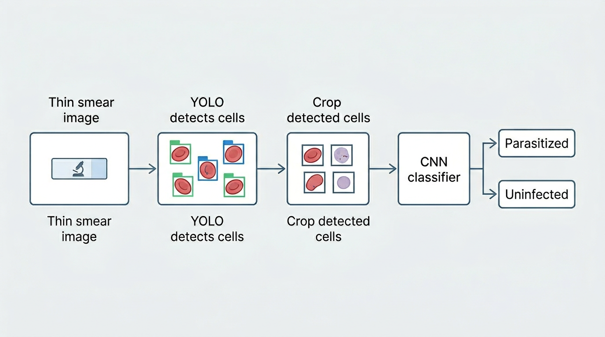
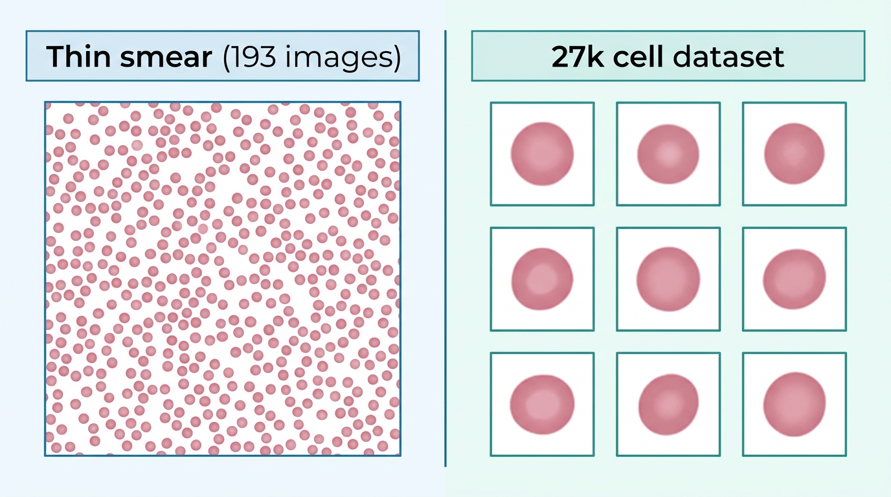

# Two-Stage Baseline

This folder contains scripts for the **two-stage pipeline** used in the malaria detection project. The guide below uses simple language so that anyone with basic machine learning knowledge can follow it.

---

## What is a two-stage pipeline?

In **end-to-end** detection, one model (e.g. YOLO) both finds the cells in an image and says whether each cell is infected or not.

In a **two-stage** pipeline we split the job into two steps:

1. **Stage 1 — Detection:** A model (YOLO) finds where the red blood cells are in the image and draws boxes around them.
2. **Stage 2 — Classification:** We crop each detected cell and pass it to a second model (a CNN classifier) that decides: *parasitized* or *uninfected*.

So: **YOLO finds the cells → we crop them → the CNN says infected or not.** 
That is the two-stage baseline.

---

## Pipeline diagram

```
Thin smear image (full microscope slide)
         ↓
   YOLO detects cells (draws boxes)
         ↓
   Crop each detected cell
         ↓
   CNN classifier predicts: parasitized or uninfected
```



---

## Why we use a two-stage baseline

This pipeline is used as a **baseline for comparison** with end-to-end models such as YOLO.

In an end-to-end model, a single network performs both detection and classification at the same time.  
In contrast, the two-stage pipeline separates these tasks.

By comparing the two approaches we can study:

- detection accuracy (how well cells are located)
- classification accuracy (how well infection is predicted)
- localisation quality
- robustness to different image conditions

This helps answer the research question:

> Is it better to detect and classify malaria cells using a single end-to-end model, or by separating detection and classification into two stages?

---

## The two datasets we use

We use **two different datasets** because they serve different roles.



### 1. The 193 thin blood smear images

- These are **large microscope images** of thin blood smears.
- Each image contains **many red blood cells** (dozens or hundreds).
- They come from **193 patients** (NIH dataset).
- We use them to **train and evaluate the detector (YOLO)** and to run the full two-stage pipeline on real-world-style images.

The cells in these images are annotated with **ground-truth bounding boxes**, which mark the location of each cell. These annotations are used to train and evaluate the detection model (YOLO).

**Role:** Teaches the model *where* cells are and lets us test “find the cells in a full slide.”

### 2. The 27,558 cell image dataset (27k dataset)

- This set has **single cells only** — each image is one cropped red blood cell.
- Each image is already **labelled** as *parasitized* or *uninfected* (about half and half).
- We use this set **only to train the classifier (Stage 2)**.

**Role:** Teaches the classifier *what* infected vs uninfected cells look like.

---

## What is the difference between them?

| | Thin smear images (193) | 27k cell dataset |
|---|--------------------------|-------------------|
| **What it is** | Full microscope images with many cells | Individual cropped cells, one per image |
| **Used for** | Training and evaluating the **detector** (YOLO); running the full pipeline | Training the **classifier** (CNN) |
| **Real-world link** | Like a real slide: the model must **locate** cells in a big image | Pre-cut cells: we only need to **classify** each crop |

- **Thin smears** = “find the cells in a full slide.”
- **27k cells** = “given one cell, is it infected or not?”

---

## Why do we need both?

- **Thin smears** are needed so the detector learns *where* cells are and we can evaluate on full-slide images (the real task).
- **27k cells** are needed so the classifier learns *what* infected and uninfected cells look like, with many labelled examples.

We combine them in the two-stage pipeline: YOLO (trained on thin smears) finds the cells; the CNN (trained on 27k cells) classifies each crop.

---

## What is the fine-tuning step (Step 2b)?

The classifier is first trained only on the **27k dataset**. Those images are clean, single-cell crops.

When we run the two-stage pipeline, the classifier instead receives **crops that YOLO cut from thin smear images**. Those crops can look a bit different (different background, lighting, or crop edges).

So we add an **optional fine-tuning step (Step 2b):**

- We take the classifier trained on 27k cells.
- We fine-tune it on **ground-truth cell crops** from the **thin smear training images**. These crops come from **ground-truth bounding boxes** (the known annotations), not from YOLO predictions, so the classifier learns from correctly centred cells during fine-tuning.
- This produces a **second model**: `runs/classifier_27k_finetuned/best.pt`.

That way the classifier also sees “smear-style” crops and often works better in the full pipeline. The original 27k-only model is **not changed**.

---

## Pipeline steps and scripts

| Step | What it does | Script |
|------|----------------|--------|
| **Step 1** | Check that the 27k cell dataset is present and correctly organised | `step1_check_cell_images.py` |
| **Step 2** | Train the classifier on the 27k cell dataset | `step2_train_classifier_27k.py` |
| **Step 2b** (optional) | Fine-tune the classifier on thin smear ground-truth crops | `step2b_finetune_classifier_thinsmear.py` |
| **Step 3** | Run the two-stage pipeline: YOLO detects → crop → CNN classifies (on val/test images) | `step3_two_stage_inference.py` |
| **Step 4** | Evaluate the results using detection and classification metrics (Precision, Recall, F1 score, and classification accuracy) | `step4_evaluate_two_stage.py` |

---

## The two classifier versions

We keep **two** classifier models so we can compare them fairly:

| Model | What it is |
|-------|-------------|
| **`runs/classifier_27k/best.pt`** | Trained **only** on the 27k cell dataset. Good for comparing to published baselines that use the same 27k set. |
| **`runs/classifier_27k_finetuned/best.pt`** | The same classifier **after** fine-tuning on thin smear ground-truth crops. Often better when used in the full pipeline. |

The **original** 27k model is never overwritten. In Step 3 you choose which model to use with `--classifier_weights`.

---

## What the evaluation measures

Step 4 evaluates three things. This helps you understand what the numbers mean when you see the results.

1. **Detection / localisation**  
   *Question:* Did YOLO correctly locate the cell?  
   *Metrics:* Precision, Recall, and F1 score (based on whether the predicted box overlaps a ground-truth cell).

2. **Classification**  
   *Question:* For each cell that was detected, did the classifier predict the correct label (parasitized or uninfected)?  
   *Metrics:* Classification accuracy (on the cells that were successfully matched to ground truth).

3. **End-to-end performance**  
   A prediction counts as **correct** only if: (1) the predicted box overlaps the real cell (IoU ≥ 0.5), **and** (2) the classifier predicts the correct infection label.  
   Precision, Recall, and F1 are then computed using this stricter definition of “correct.”

---

## How to run (from project root)

```bash
# Step 1 — Check 27k dataset
python3 scripts/two_stage_baseline/step1_check_cell_images.py

# Step 2 — Train classifier on 27k
python3 scripts/two_stage_baseline/step2_train_classifier_27k.py

# Step 2b (optional) — Fine-tune on thin smear crops
python3 scripts/two_stage_baseline/step2b_finetune_classifier_thinsmear.py

# Step 3 — Two-stage inference (baseline classifier)
python3 scripts/two_stage_baseline/step3_two_stage_inference.py --split val
python3 scripts/two_stage_baseline/step3_two_stage_inference.py --split test

# Step 3 with fine-tuned classifier (use suffix so baseline results are not overwritten)
python3 scripts/two_stage_baseline/step3_two_stage_inference.py --split val --classifier_weights runs/classifier_27k_finetuned/best.pt --suffix finetuned
python3 scripts/two_stage_baseline/step3_two_stage_inference.py --split test --classifier_weights runs/classifier_27k_finetuned/best.pt --suffix finetuned

# Step 4 — Evaluate (baseline)
python3 scripts/two_stage_baseline/step4_evaluate_two_stage.py --split val
python3 scripts/two_stage_baseline/step4_evaluate_two_stage.py --split test

# Step 4 — Evaluate (fine-tuned)
python3 scripts/two_stage_baseline/step4_evaluate_two_stage.py --split val --suffix finetuned
python3 scripts/two_stage_baseline/step4_evaluate_two_stage.py --split test --suffix finetuned
```

---

## Keeping baseline and fine-tuned results separate

Step 3 writes files like `predictions_val.json` and `predictions_test.json`. If you run Step 3 again with the **fine-tuned** classifier, use one of:

- **`--suffix finetuned`** — Saves `predictions_val_finetuned.json` and `predictions_test_finetuned.json` in the same folder (recommended).
- **`--output_dir runs/two_stage_baseline_finetuned`** — Saves all fine-tuned outputs in a different folder.

Then run Step 4 with `--suffix finetuned` or `--predictions <path>` so you evaluate the right file.

---
